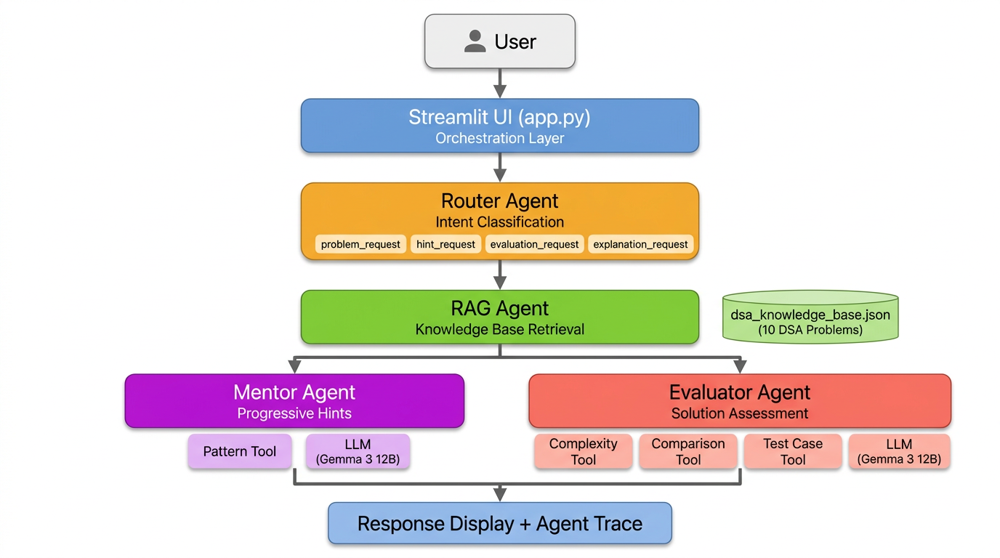

# AlgoMentor AI

An interactive DSA (Data Structures & Algorithms) interview-prep application
built with **Streamlit**. Demonstrates **multi-agent orchestration**,
**Retrieval-Augmented Generation (RAG)**, and **function-calling / tool usage**
as required by the SYSEN 5381 Homework 2 rubric.

---

## Project Overview

AlgoMentor AI lets a user:

1. **Request a DSA problem** filtered by topic and difficulty.
2. **Ask for progressive hints** grounded in retrieved problem data and algorithmic patterns.
3. **Submit a solution** (code or plain text) and receive structured evaluation
   including correctness estimate, complexity analysis, missing concepts,
   and improvement suggestions.

The app integrates with **Ollama Cloud** (Gemma 3 12B) for natural-language
mentor hints and code reviews. When no API key is configured, all agents
fall back to deterministic template-based responses — the app is fully
functional either way.

---

## Architecture



Every user interaction flows through a **four-agent pipeline**:

1. **Router Agent** classifies user intent via keyword matching
2. **RAG Agent** retrieves the most relevant problem from the JSON knowledge base
3. **Mentor Agent** or **Evaluator Agent** is dispatched based on intent, calling tools and optionally the LLM

All agent decisions and tool calls are logged in the **Agent Trace** panel.

---

## Agent Descriptions

| Agent | File | Role |
|-------|------|------|
| **Router Agent** | `agents/router_agent.py` | Classifies user intent into `problem_request`, `hint_request`, `evaluation_request`, or `explanation_request` using deterministic keyword matching. |
| **RAG Agent** | `agents/rag_agent.py` | Loads the local JSON knowledge base, filters by topic/difficulty, and scores candidates using keyword overlap to retrieve the most relevant problem. |
| **Mentor Agent** | `agents/mentor_agent.py` | Delivers progressive hints from the retrieved problem, calls the **pattern tool** for algorithmic guidance, and optionally uses the LLM for natural-language responses. |
| **Evaluator Agent** | `agents/evaluator_agent.py` | Evaluates a user's solution by calling the **complexity tool**, **comparison tool**, and **test case tool**, then optionally uses the LLM to synthesize a constructive review. |

---

## Tool Descriptions

| Tool | File | Function | Purpose |
|------|------|----------|---------|
| **Pattern Tool** | `tools/pattern_tool.py` | `get_pattern_hint(topic_or_tags)` | Returns common algorithmic patterns (e.g., Two Pointer, Sliding Window, BFS/DFS) for a given topic or tag list. |
| **Complexity Tool** | `tools/complexity_tool.py` | `analyze_complexity(solution_text)` | Uses regex heuristics to estimate time and space complexity from submitted code or text. |
| **Comparison Tool** | `tools/comparison_tool.py` | `compare_solution_keywords(user_solution, reference_approach)` | Compares user solution keywords against the reference approach using code-to-concept mapping and returns an alignment summary. |
| **Test Case Tool** | `tools/testcase_tool.py` | `generate_test_cases(problem)` | Returns 3–5 sample and edge test cases for a given problem. |

Each tool module includes a `TOOL_METADATA` dictionary following the function-calling schema format.

---

## Knowledge Base

The file `data/dsa_knowledge_base.json` contains **10 curated DSA problems**
spanning 7 topics:

| # | Problem | Topic | Difficulty |
|---|---------|-------|------------|
| 1 | Two Sum | Arrays | Easy |
| 2 | Valid Anagram | Hashing | Easy |
| 3 | Binary Search | Binary Search | Easy |
| 4 | Best Time to Buy and Sell Stock | Arrays | Easy |
| 5 | Merge Two Sorted Lists | Linked Lists | Easy |
| 6 | Maximum Depth of Binary Tree | Trees | Easy |
| 7 | Number of Islands | Graphs | Medium |
| 8 | 3Sum | Arrays | Medium |
| 9 | Coin Change | Dynamic Programming | Medium |
| 10 | LRU Cache | Hashing | Medium |

Each entry includes: `id`, `title`, `difficulty`, `topic`, `tags`,
`problem_statement`, `hints` (3 progressive), `approach_summary`,
`expected_time_complexity`, and `expected_space_complexity`.

---

## Setup Instructions

### Prerequisites

- Python 3.10 or later
- An Ollama Cloud API key (optional — for LLM-enhanced responses)

### Install Dependencies

```bash
git clone https://github.com/YOUR_USERNAME/AlgoMentor-AI.git
cd AlgoMentor-AI
python -m venv venv
source venv/bin/activate   # Windows: venv\Scripts\activate
pip install -r requirements.txt
```

### Configure API Key (Optional)

Create a `.env` file in the project root:

```
OLLAMA_API_KEY=your-ollama-cloud-api-key
```

The app will show a green "LLM enabled" badge in the sidebar when the key
is loaded. Without it, all features still work using template-based responses.

### Run the App

```bash
streamlit run app.py
```

Opens at `http://localhost:8501`.

---

## How to Use

1. **Select a topic** and **difficulty** in the sidebar.
2. Choose an **action**:
   - *Get Problem* — retrieves a matching DSA problem from the knowledge base.
   - *Get Hint* — shows the next progressive hint for the current problem.
   - *Evaluate Solution* — paste your code in the text area, then run.
3. Optionally type a request in the text field to refine retrieval.
4. Click **Run**.
5. View results in the main panel; expand **Agent Trace** at the bottom to
   see which agents ran and which tools were called.

---

## File Structure

```
AlgoMentor-AI/
├── app.py                          # Streamlit entry point + orchestration
├── requirements.txt                # Python dependencies
├── .env                            # API key (not committed to git)
├── .gitignore                      # Excludes .env, venv/, __pycache__/
├── README.md                       # This file
├── docs/
│   └── architecture_diagram.png    # System architecture diagram
├── agents/
│   ├── __init__.py
│   ├── router_agent.py             # Intent classification
│   ├── rag_agent.py                # Knowledge-base retrieval
│   ├── mentor_agent.py             # Progressive hints + pattern tool + LLM
│   └── evaluator_agent.py          # Solution evaluation + 3 tools + LLM
├── tools/
│   ├── __init__.py
│   ├── pattern_tool.py             # Algorithmic pattern lookup
│   ├── testcase_tool.py            # Test case generation
│   ├── complexity_tool.py          # Big-O complexity estimation
│   └── comparison_tool.py          # Keyword alignment analysis
├── data/
│   └── dsa_knowledge_base.json     # 10 DSA problems (RAG corpus)
└── utils/
    ├── __init__.py
    ├── helpers.py                  # Loading, formatting utilities
    ├── prompts.py                  # Agent role descriptions & templates
    └── llm.py                      # Ollama Cloud API wrapper
```

---

*SYSEN 5381 — Data Science & AI · Cornell University*
